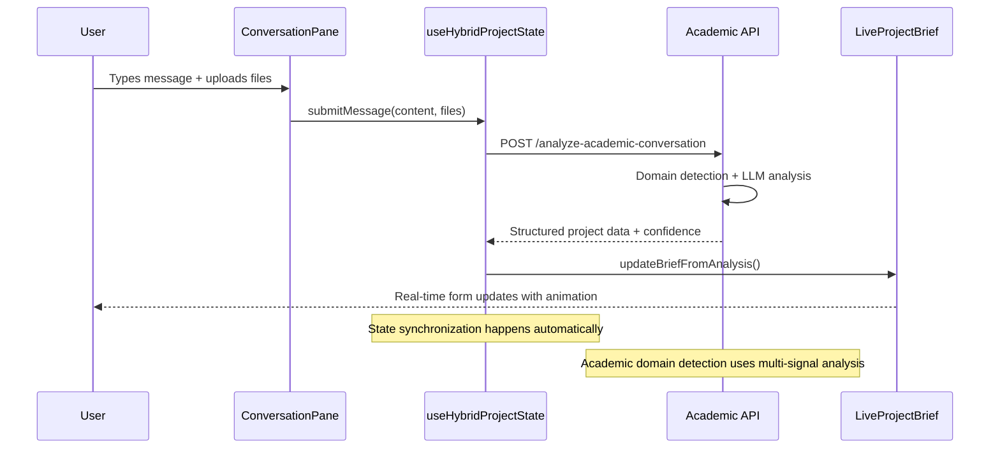
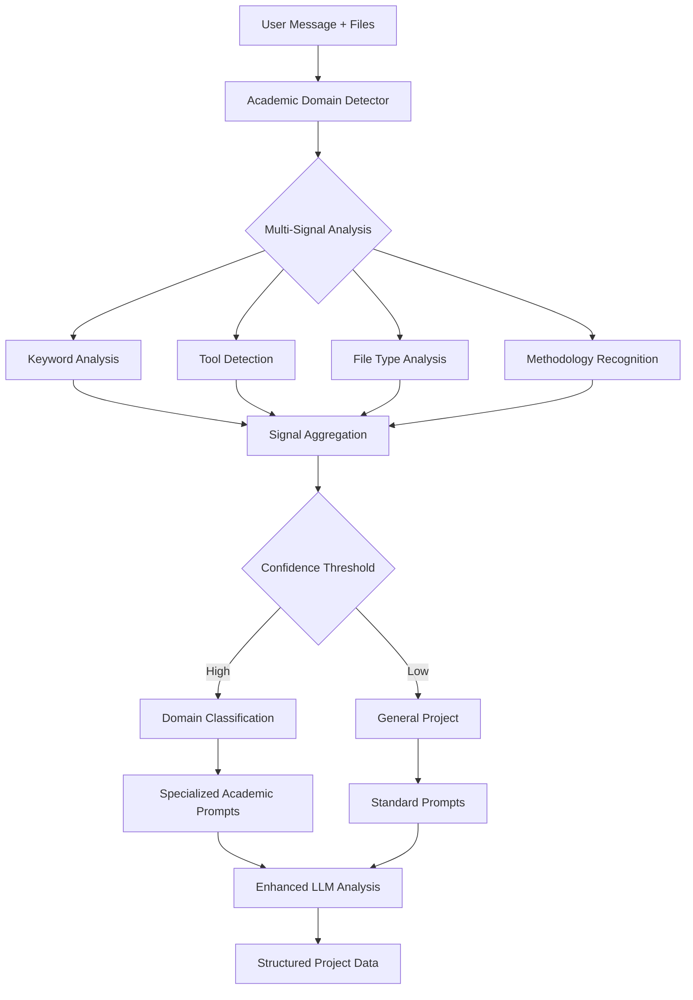

# Projects Page Architecture Overview

**Author:** Claude Code  
**Last Updated:** January 29, 2025  
**Echo Version:** 2025.01 - Academic Intelligence Integration

---

## Table of Contents
1. [Development Best Practices](#development-best-practices)
2. [Architecture Overview](#architecture-overview)
3. [Component Hierarchy](#component-hierarchy)
4. [Data Flow Architecture](#data-flow-architecture)
5. [API Endpoints](#api-endpoints)
6. [State Management](#state-management)
7. [Academic Intelligence Integration](#academic-intelligence-integration)
8. [File Upload System](#file-upload-system)
9. [Error Handling & Resilience](#error-handling--resilience)
10. [Performance Optimizations](#performance-optimizations)
11. [Known Issues](#known-issues)
12. [Next Steps](#next-steps)

---

## Development Best Practices

Throughout the development of the projects page, several key best practices have been consistently applied:

### Code Organization & Architecture
- **Single Responsibility Principle**: Each component and hook has a clear, focused purpose
- **Composition over Inheritance**: Components are built through composition of smaller, reusable units
- **Separation of Concerns**: UI logic, state management, and business logic are cleanly separated
- **Defensive Programming**: Comprehensive error handling and graceful degradation at every level

### TypeScript Implementation
- **Strict Type Safety**: All interfaces and types are explicitly defined with no `any` usage
- **Pydantic-Style Validation**: Backend uses Pydantic models that mirror frontend TypeScript interfaces
- **API Contract Enforcement**: Shared type definitions ensure frontend/backend compatibility

### React Development Patterns
- **Custom Hooks for Logic**: Complex logic extracted into reusable, testable hooks
- **Controlled Components**: All form state managed through React state with proper validation
- **Error Boundaries**: Component-level error boundaries for graceful failure handling
- **Optimistic Updates**: UI updates immediately with rollback on API failures

### LLM Integration Philosophy
- **Structured Outputs**: All LLM calls use structured response formats (JSON) with Pydantic validation
- **Two-Model Strategy**: Strategic use of Claude Opus for complex reasoning, Sonnet for structured processing
- **Confidence Scoring**: All AI outputs include confidence metrics for transparency
- **Fallback Mechanisms**: Graceful degradation when AI services are unavailable

### Academic Domain Focus
- **Domain-Specific Intelligence**: Specialized detection and handling for academic/research contexts
- **Multi-Signal Analysis**: Academic domain detection uses keywords, tools, methodologies, and file types
- **Research-Aware Prompting**: LLM prompts tailored for academic terminology and research workflows

---

## Architecture Overview

The Projects Page implements a sophisticated hybrid conversational interface that combines real-time AI chat with structured form editing. The architecture follows a three-tier pattern:

```
┌─────────────────────────────────────────────────────────────────┐
│                     FRONTEND LAYER                              │
│  ┌─────────────────┐  ┌─────────────────┐  ┌─────────────────┐ │
│  │   Projects      │  │  Hybrid Project │  │   Component     │ │
│  │   Dashboard     │  │    Creator      │  │   Libraries     │ │
│  │                 │  │                 │  │                 │ │
│  │ • ProjectList   │  │ • Conversation  │  │ • UI Components │ │
│  │ • Filters       │  │ • LiveBrief     │  │ • Toast System  │ │
│  │ • Search        │  │ • FileUpload    │  │ • Loading States│ │
│  └─────────────────┘  └─────────────────┘  └─────────────────┘ │
└─────────────────────────────────────────────────────────────────┘
                                │
                    ┌───────────┴───────────┐
                    │     API LAYER         │
                    │                       │
                    │ • FastAPI Router      │
                    │ • Request Validation  │
                    │ • Response Formatting │
                    │ • Error Handling      │
                    │ • Streaming Support   │
                    └───────────┬───────────┘
                                │
┌─────────────────────────────────────────────────────────────────┐
│                    BACKEND LAYER                                │
│  ┌─────────────────┐  ┌─────────────────┐  ┌─────────────────┐ │
│  │   Database      │  │  LLM Services   │  │   Academic      │ │
│  │   Layer         │  │                 │  │  Intelligence   │ │
│  │                 │  │ • Claude Client │  │                 │ │
│  │ • SQLite        │  │ • Prompt Mgmt   │  │ • Domain Detect │ │
│  │ • CRUD Ops      │  │ • Response Parse│  │ • Signal Anal   │ │
│  │ • Data Models   │  │ • Stream Mgmt   │  │ • Context Build │ │
│  └─────────────────┘  └─────────────────┘  └─────────────────┘ │
└─────────────────────────────────────────────────────────────────┘
```

---

## Component Hierarchy

### Main Projects Page (`/app/projects/page.tsx`)
The root component that orchestrates the entire projects experience:

```typescript
ProjectsPage
├── ProjectsHeader (search, filters, create buttons)
├── ProjectList (main dashboard)
│   ├── ProjectCard[] (individual project displays)
│   └── ProjectStats (analytics summary)
├── HybridProjectCreator (modal for AI-assisted creation)
│   ├── ConversationPane (left side - chat interface)
│   │   ├── MessageList (conversation history)
│   │   ├── ConversationInput (text input + file upload)
│   │   └── FileUploadZone (drag-drop file handling)
│   └── LiveProjectBrief (right side - structured form)
│       ├── ProjectMetadata (name, type, description)
│       ├── AcademicDomainDisplay (domain classification)
│       ├── DeliverablesList (research outputs)
│       └── ProjectTimeline (roadmap visualization)
└── ProjectDetailModal (view/edit existing projects)
```

### Key Component Characteristics

**HybridProjectCreator** - The centerpiece component that implements the "AI Consultant with Live Whiteboard" pattern:
- CSS Grid layout (60/40 split) for optimal space utilization
- Real-time bidirectional synchronization between chat and form
- Mobile-responsive with stack layout for smaller screens
- Smooth animations using Tailwind's transition system
- Component maintains <200 lines by delegating to specialized children

**LiveProjectBrief** - The structured form that updates in real-time:
- Field-level confidence indicators showing AI certainty
- Academic domain visualization with multi-signal analysis results
- Editable deliverables with research-specific terminology
- Project timeline with academic milestone templates

**ConversationPane** - The chat interface with advanced capabilities:
- File upload integration with academic file type recognition (50+ extensions)
- Message streaming with typing indicators
- Context-aware responses based on academic domain detection
- Error recovery and retry mechanisms

---

## Data Flow Architecture

### Conversation → Brief Synchronization Flow



### Academic Domain Detection Flow



### State Management Pattern

The projects page uses a unified state management approach with the `useHybridProjectState` hook:

```typescript
interface HybridWizardState {
  conversation: ConversationState;     // Chat messages and AI responses
  brief: BriefState;                   // Structured project form data
  ai_responses: AIResponse[];          // Active AI suggestions
  phase: 'gathering' | 'refining' | 'finalizing' | 'complete';
  can_create_project: boolean;         // Validation state
  error: string | null;                // Global error handling
}
```

**Key State Management Principles:**
- **Single Source of Truth**: All state flows through one master hook
- **Immutable Updates**: State changes use spread operators for React optimization
- **Optimistic Updates**: UI updates immediately, with rollback on API failures
- **Loading State Management**: Comprehensive loading indicators at operation level

---

## API Endpoints

### Core Project Management
- `GET /projects` - List projects with filtering, search, and pagination
- `GET /projects/{id}` - Get single project with full details
- `POST /projects` - Create new project (traditional form-based)
- `PUT /projects/{id}` - Update existing project
- `DELETE /projects/{id}` - Delete project (cascade to related data)

### Hybrid Wizard Endpoints
- `POST /projects/analyze-conversation` - Standard conversation analysis
- `POST /projects/analyze-academic-conversation` - **Academic-enhanced analysis**
- `POST /projects/generate-roadmap` - AI roadmap generation (Sonnet + Opus)
- `POST /projects/create-hybrid` - Create project from conversation data

### Academic Intelligence Endpoints
- `POST /projects/analyze-academic-conversation` - Core academic analysis endpoint
  - Uses AcademicDomainDetector for multi-signal domain classification
  - Employs specialized academic prompts for research terminology
  - Returns structured data with academic context and confidence scores

### Conversation Management (Advanced Features)
- `POST /conversations/start` - Initialize conversation state
- `POST /conversations/{id}/message` - Send message with AI response
- `POST /conversations/{id}/stream` - **Real-time streaming responses**
- `GET /conversations/{id}` - Get conversation history
- `POST /conversations/{id}/complete` - Finalize conversation to project

### Response Structure Standards
All API responses follow consistent patterns:

```typescript
interface APIResponse<T> {
  data: T;
  success: boolean;
  error?: string;
  confidence?: number;      // For AI-generated content
  metadata?: {
    generated_at: string;
    ai_model: string;
    processing_time_ms: number;
  };
}
```

---

## State Management

### useHybridProjectState - Master Hook

This is the orchestrating hook that manages the entire hybrid wizard state:

```typescript
const useHybridProjectState = (config: HybridProjectConfig) => {
  // State hooks composition
  const conversation = useConversation(config);
  const brief = useBriefState(config);
  const responses = useActiveResponses(config);
  
  // Orchestration service for complex workflows
  const orchestrationService = useRef(new WizardOrchestrationService(config));
  
  // Unified interface for components
  return {
    state: { conversation, brief, responses, ... },
    actions: { submitMessage, updateBriefField, createProject, ... },
    computed: { canCreateProject, overallConfidence, ... }
  };
};
```

### Specialized State Hooks

**useConversation** - Chat state management:
- Message history with real-time updates
- File upload integration
- Streaming response handling
- Error recovery and retry logic

**useBriefState** - Form state management:
- Field-level validation and confidence tracking
- Academic domain integration
- Real-time roadmap generation
- Bidirectional synchronization with conversation

**useActiveResponses** - AI suggestion management:
- Response trigger analysis
- User dismissal handling
- Confidence-based prioritization

### State Synchronization Patterns

1. **Conversation → Brief**: AI analysis updates form fields automatically
2. **Brief → Conversation**: Form edits can trigger AI responses for clarification
3. **Error Propagation**: Errors bubble up through state hierarchy with context
4. **Loading Coordination**: Loading states are coordinated across all operations

---

## Academic Intelligence Integration

### AcademicDomainDetector Architecture

The academic intelligence system uses multi-signal analysis for domain classification:

```python
class AcademicDomainDetector:
    """
    Academic-focused domain detection for research projects.
    Supports 6 domains: research_analysis, scientific_software, 
    grant_writing, academic_writing, data_science, general_project
    """
    
    def detect_domain(self, messages: List[ConversationMessage], 
                     uploaded_files: List[str] = None,
                     context: Dict[str, Any] = None) -> DomainDetection:
```

### Signal Analysis Components

**Keyword Detection**: Research-specific terminology
- Academic: "hypothesis", "methodology", "literature review"
- Data Science: "machine learning", "statistical analysis", "modeling"
- Software: "package development", "API", "algorithm implementation"

**Tool Recognition**: Academic software and platforms
- R/Python: "ggplot", "pandas", "tidyverse", "scikit-learn"
- Research: "Zotero", "Mendeley", "LaTeX", "EndNote"
- Analysis: "SPSS", "Stata", "MATLAB", "Jupyter"

**File Type Analysis**: Academic document recognition
- Research Papers: `.pdf`, `.docx`, `.tex`, `.bib`
- Data Files: `.csv`, `.xlsx`, `.sav`, `.dta`, `.mat`
- Code: `.r`, `.py`, `.rmd`, `.ipynb`, `.m`

**Methodology Detection**: Research approach identification
- Quantitative: "regression", "ANOVA", "t-test", "correlation"
- Qualitative: "interview", "survey", "ethnography", "case study"
- Mixed Methods: "triangulation", "sequential", "concurrent"

### Enhanced LLM Prompting

Academic projects receive specialized prompts:

```python
academic_prompt = f"""
You are an AI project consultant specializing in academic research projects.

Academic Domain: {domain_detection.domain} (confidence: {domain_detection.confidence:.2f})
Domain Analysis: {domain_detection.reasoning}

Focus on:
- Research methodology and theoretical framework
- Academic deliverables (papers, presentations, software)
- Timeline considerations for research phases
- Collaboration and stakeholder management in academic context
"""
```

### Confidence Scoring Integration

Academic analysis includes multiple confidence metrics:
- **Domain Confidence**: How certain the system is about academic classification
- **Analysis Confidence**: LLM confidence in extracted project data
- **Overall Confidence**: Weighted combination for user transparency

---

## File Upload System

### Supported Academic File Types (50+ Extensions)

```typescript
const ACADEMIC_FILE_PATTERNS = {
  // Research Documents
  research: ['.pdf', '.docx', '.tex', '.bib', '.rtf'],
  
  // Data Files
  data: ['.csv', '.xlsx', '.sav', '.dta', '.mat', '.json'],
  
  // Code & Analysis
  code: ['.r', '.py', '.rmd', '.ipynb', '.m', '.sas', '.do'],
  
  // Presentations & Figures
  presentation: ['.pptx', '.key', '.png', '.jpg', '.svg', '.eps'],
  
  // Reference Management
  references: ['.ris', '.enw', '.xml', '.bib']
};
```

### File Processing Pipeline

1. **Upload Validation**: File type, size, and academic relevance checking
2. **Context Extraction**: Filename analysis for project relevance signals
3. **Domain Detection**: File extensions contribute to academic domain classification
4. **Integration**: File context included in LLM analysis prompts

### File Upload UI Features

- **Drag-and-drop interface** with visual feedback
- **Multiple file selection** with progress tracking
- **File type validation** with helpful error messages
- **Preview capabilities** for common academic formats
- **Context annotation** allowing users to describe file relevance

---

## Error Handling & Resilience

### Multi-Layer Error Strategy

**Frontend Error Boundaries**:
```typescript
class ProjectsErrorBoundary extends React.Component {
  // Catches and handles component-level errors
  // Provides graceful degradation with retry options
  // Logs errors for debugging while maintaining UX
}
```

**API Error Handling**:
- **Structured Error Responses**: Consistent error format across all endpoints
- **HTTP Status Code Mapping**: Proper REST status codes with descriptive messages
- **Retry Logic**: Automatic retry for transient failures (network, LLM timeouts)
- **Fallback Mechanisms**: Academic endpoint falls back to standard analysis on failure

**LLM Integration Resilience**:
- **Response Validation**: All LLM responses validated against Pydantic schemas
- **Fallback Responses**: Pre-defined fallback data for LLM service outages
- **Timeout Handling**: Graceful timeout handling with user notification
- **Rate Limiting**: Built-in rate limiting with queue management

**Database Error Recovery**:
- **Transaction Rollback**: Automatic rollback on failed operations
- **Connection Pooling**: Robust connection management with automatic retry
- **Data Validation**: Server-side validation prevents corrupt data entry

### User Experience During Errors

- **Toast Notifications**: Non-intrusive error communication
- **Retry Buttons**: Clear retry actions for recoverable errors
- **Partial Success Handling**: Save what's possible, report what failed
- **Loading State Management**: Proper loading states during error recovery

---

## Performance Optimizations

### Frontend Performance

**React Optimization Patterns**:
- **useMemo/useCallback**: Strategic memoization of expensive operations
- **Component Splitting**: Large components split into focused sub-components
- **Virtual Scrolling**: Efficient handling of large project lists
- **Debounced Operations**: Search and API calls debounced for performance

**Bundle Optimization**:
- **Code Splitting**: Lazy loading of project creation components
- **Tree Shaking**: Unused code elimination in production builds
- **Asset Optimization**: Images and fonts optimized for web delivery

### Backend Performance

**Database Optimization**:
- **Indexing Strategy**: Proper indexes on frequently queried fields
- **Query Optimization**: Efficient SQL queries with minimal N+1 problems
- **Connection Pooling**: Reused database connections for better throughput

**LLM Service Optimization**:
- **Request Batching**: Multiple analysis requests batched when possible
- **Response Caching**: Caching of common analysis patterns
- **Model Selection**: Strategic use of faster models for routine operations

**API Performance**:
- **Response Compression**: Gzip compression for large responses
- **Pagination**: Efficient pagination for large datasets
- **Async Operations**: Non-blocking operations for better concurrency

### Monitoring & Observability

- **Performance Metrics**: Response time and throughput monitoring
- **Error Tracking**: Comprehensive error logging and alerting
- **User Analytics**: Usage patterns and performance impact analysis

---

## Known Issues

### Current Limitations

1. **Academic Domain Detection Accuracy**
   - **Issue**: Domain detection sometimes returns low confidence scores
   - **Impact**: Falls back to generic project analysis instead of academic-specific prompts
   - **Status**: Under investigation - may need signal weight tuning

2. **File Upload Size Limits**
   - **Issue**: Large academic files (>10MB) may timeout during upload
   - **Impact**: Users cannot upload large datasets or comprehensive research documents
   - **Workaround**: Multiple smaller file uploads

3. **Real-time Synchronization Edge Cases**
   - **Issue**: Rapid user edits can occasionally cause state desynchronization
   - **Impact**: Brief form may not reflect latest conversation analysis
   - **Mitigation**: Automatic recovery on next AI response

4. **Mobile Responsiveness**
   - **Issue**: Split-pane layout needs optimization for tablet sizes
   - **Impact**: Suboptimal UX on iPad and similar devices
   - **Status**: Responsive breakpoints need refinement

### Performance Considerations

1. **LLM Response Times**
   - Academic analysis can take 3-5 seconds due to complex prompting
   - Streaming responses help with perceived performance
   - Consider caching common analysis patterns

2. **Database Query Performance**
   - Project list queries may slow down with large project counts
   - Consider implementing virtual scrolling or server-side pagination

3. **Bundle Size Impact**
   - Academic intelligence features add ~150KB to bundle size
   - Code splitting implementation planned for optimization

---

## Next Steps

### Immediate Priorities (Sprint 1-2)

1. **Academic Domain Detection Tuning**
   - Analyze domain detection accuracy across real-world examples
   - Adjust signal weights and confidence thresholds
   - Add more comprehensive academic vocabulary

2. **Enhanced File Upload Support**
   - Implement file content parsing for better context extraction
   - Add support for cloud file integration (Google Drive, Dropbox)
   - Improve file size handling for large academic datasets

3. **Mobile Experience Optimization**
   - Redesign split-pane layout for mobile/tablet
   - Implement swipe navigation between conversation and brief
   - Optimize touch interactions for academic domain displays

### Medium-term Enhancements (Sprint 3-6)

4. **Expert Persona System**
   - Implement ExpertPersona base class with CO-STAR framework
   - Create 4 specialized academic personas (Research, Writing, Analysis, Software)
   - Add persona selection based on domain detection confidence

5. **Advanced Academic Context**
   - Bibliography integration with citation management
   - Research timeline templates for different academic domains
   - Collaboration features for multi-author projects

6. **Performance & Scalability**
   - Implement response caching for common academic patterns
   - Add real-time collaboration features
   - Optimize database queries for large project portfolios

### Long-term Vision (Sprint 7+)

7. **Research Integration Ecosystem**
   - Integration with academic databases (PubMed, ArXiv, etc.)
   - Reference management system integration
   - Academic calendar and milestone tracking

8. **Advanced AI Features**
   - Multi-modal analysis (document content + conversation)
   - Automated literature review suggestions
   - Research methodology recommendations

9. **Analytics & Insights**
   - Academic productivity analytics
   - Research pattern recognition
   - Publication timeline optimization

### Technical Debt & Maintenance

- **Type Safety**: Ensure all API contracts are properly typed
- **Test Coverage**: Increase test coverage for academic intelligence features
- **Documentation**: Expand inline documentation for complex LLM integration patterns
- **Security**: Review file upload security for academic document handling

### Development Environment Setup

For new engineers joining the project:

1. **Prerequisites**: Node.js 18+, Python 3.11+, Claude API access
2. **Setup Commands**:
   ```bash
   npm install                           # Frontend dependencies
   pip install -r requirements.txt      # Backend dependencies
   python api_server.py                 # Start backend API
   npm run dev                          # Start frontend dev server
   ```
3. **Environment Variables**: Configure `.env.local` with Claude API keys
4. **Testing**: `npm run test` for frontend, `pytest` for backend

### Architecture Decision Records

- **ADR-001**: Split-pane layout chosen over tabbed interface for better context retention
- **ADR-002**: Academic domain detection implemented as separate service for reusability
- **ADR-003**: Two-model LLM strategy (Opus/Sonnet) for cost-performance optimization
- **ADR-004**: Unified state management hook pattern for complex component coordination

---

**Last Updated:** January 29, 2025  
**Next Review:** February 15, 2025  
**Maintainer:** Echo Development Team